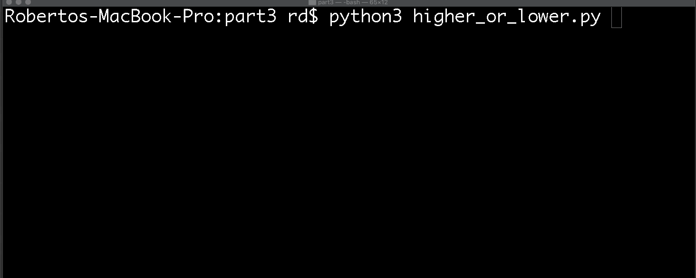

# Part 3

## Accompanying resources
* Slide deck:  https://zipcoder.github.io/curriculum-assets/lectures/python/conditional-operators/

## Exercise 1

For this exercise we will be importing some existing functionality from the standard library. 
The [random module](https://docs.python.org/3.8/library/random.html#module-random) gives us the ability to generate pseudo-random numbers.

Try the code below in the Python interpreter.
```python
from random import randrange
print(randrange(10))
# 7 
print(randrange(10))
# 1
print(randrange(10))
# 5
print(randrange(10))
# 6
print(randrange(10))
# 5
```

## Exercise 2

Create a program called *higher_or_lower.py*

The program must meet the following criteria.

* A function that asks the user to provide a number between 0 and 10.
* A function that returns a random number between 1 and 10.
* A function that evaluates the randomly generated number against the user's guess.
* At the end, the program must output the following:
    * The random number that was generated.
    * The user's guess.
    * An indication if the user guess correctly or if the user's guess was too high/too low.



## Exercise 3 

Copy the *greet.py* program from part 2 and name it *multilingual_greeter.py*

Extend the program so that it meets the following requirements.

* Add a function called *language_input* that gives the user an option to choose 1 of at least 3 languages.
* Ask the user for his name in the chosen language.
* Greet the user in the chosen language.
